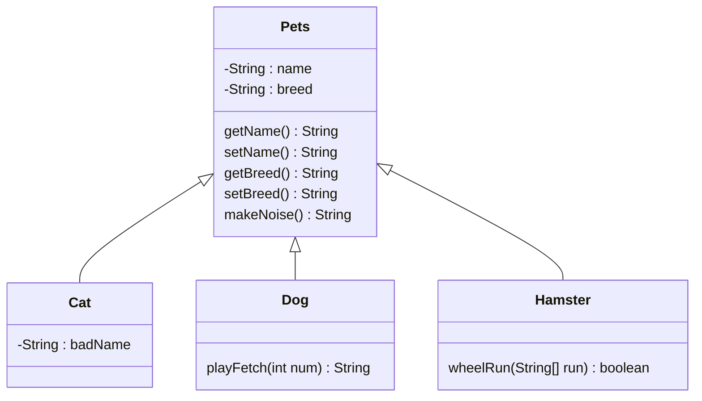

# Lab04PetStore
Inheritance/overwriting Application Lab

Model for Inheritance


# Step 1 -- Writing the Constructors
Cat, Dog, and Hamster all inherit from Pets. Look at the Pets constructor. You will notice that the constructor for Pets constructs the same two variables that Cat, Dog, and Hamster are constructed with. Use `super()` to build the Cat, Dog, and Hamster constructors. 

For an example of how super() is used, see below:
```java
public class Clown{
    String name;
    public Clown(String name){
        this.name = name;
    }
    public String entertain(){
        return "honk nose";
    }
}

public class Sad extends Clown{
    public Sad(String name){
        super(name);            //Remember to put the variables in the exact order they appear in the constructor
    }
}
```

To check your work, try constructing some objects of each type in their respective mains like this:
```java
Cat Gyorik = new Cat("Gyorik", "russian blue");
```
# Step 2 -- Overriding makeNoise()
As you have likely noticed by now, the default string returned by Pets is "\[animal sound]". Of course, cats, dogs, and hamsters have more specific noises than this. use `@Override` to override the `makeNoise()` for Cat, Dog, and Hamster.
```
Cat should return "meow"
Dog should return "bark"
Hamster should return "squeak"
```

Here is an example of using @override using the example class Clown with the inheritting class Sad from the previous step:
```java
    //in Sad:
    @Override
    public String entertain(){
        return "cry";
    }
```
To test your work, try calling makeNoise() on each of the objects you made to test the previous step like this:
```java
System.out.println(Gyorik.makeNoise());
```
# Step 3 -- Class-Specific Methods
Cats, dogs, and hamsters are all different kinds of pets, so there are different things they are each known for. write playFetch() for Dog and wheelRun() for Hamster so that they do the following:
```
1. playFetch() will take in an int and multiply that number by 7. If the resulting number is even, return "returned the ball", otherwise, return "won't give it back"
2. wheelRun() will take in an Array of Strings. If any of the strings is the phrase "tired", return false. If "tired" never appears, return true.
```
To test these, make Dog and Hamster objects in their respective mains and call the methods with them like this:
```java
Dog Fido = new Dog("Fido", "mixed");
System.out.println(Fido.playFetch(3)); //this should return "won't give it back"
```
And this:
```java
String[] run = {"sad", "happy", "angry", "excited", "energized"};
Hamster Chewy = new Hamster("Chewy", "dwarf");
System.out.println(Chewy.wheelRun(run));  //this should return true
```
# Step 4 -- Altering Cat
Cats typically have a secondary name that their owners call them when they misbehave. Make a class variable for Cat called `badName` and add it to the cat constructor so that it gets constructed. Override getName() for Cat to now return "[name] aka [badName]".

For Example, using our original Cat object, Gyorik, we would now test it like this:
```java
Cat Gyorik = new Cat("Gyorik", "russian blue", "Wretched Man");
System.out.println(Gyorik.getName()); //this should now return "Gyorik aka Wretched Man"
```

# Step 5 -- Turning in to Zybooks
Turn it in to submit mode on Zybooks!
